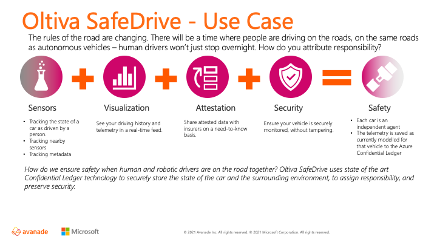
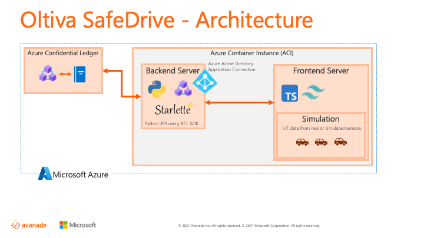

# Azure Confidential Ledger

## About Azure Confidential Ledger

Azure Confidential Ledger provides tamperproof, unstructured data store hosted in trusted execution environments (TEEs) and backed by cryptographically verifiable evidence.

Azure Confidential Ledger provides a managed and decentralized ledger for data entries backed by Blockchain. Maintain data integrity by preventing unauthorized or accidental modification with tamperproof storage. Protect your data at rest, in transit, and in use with hardware-backed secure enclaves used in Azure confidential computing.

[More Information](https://docs.microsoft.com/en-gb/azure/confidential-ledger/overview?WT.mc_id=AI-MVP-5004204)

## Use Case

The demo presented utilises Azure Confidential Ledger for storing IoT telemetry from vehicles on the road.

Using the [standard of automation systems](https://www.sae.org/standards/content/j3016_202104/) defined by the Society of Automative Engineers, vehicles are considered to range in smartness from level 0 (no automation), to level 5 (full driving automation).

This use case is based around the idea that as cars get smarter, from level 0-level 1 (the cars most people drive), to Tesla (level 2, with self driving autopiliot) and beyond - we need a way to determine responsibility and liability.

Human drivers aren't going away overnight, without regulatory pressure. If a car driven by a human, collides with a "smarter car", how do you prove who is at fault? In other scenarios, for better or worse, people tend to side with the computer.

Most cars already have sensors - and each new generation incorporates more. We're storing the attributes of the vehicle on the ledger, timestamped as they change over time. 
 
In the event of a crash, by comparing the data from one car, to the data on another (if it exists), you could compare braking pressure, signalling, speed, and heading, to determine liability - insurers would be one stakeholder, but vehicle manufacturers would be another, particularly as many nation-states seem to be settling on the idea that manufacturers may be liable in the event of a crash.

### Visual Overview

