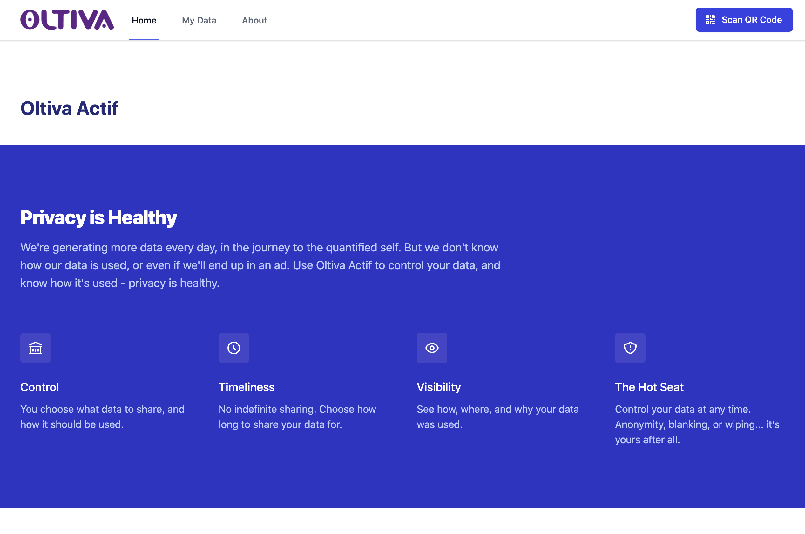

# SQL Ledger

## About SQL Ledger

SQL Ledger is for data scenarios that may require asecure centralised ledger similar to those used in blockchain, where using a blockchain may be overkill.

SQL Ledger:

- Makes data in SQL tamper-evident through cryptography
- Provides a historical record of all changes, verified through cryptographic proof
- Works in the same way to SQL hosted on Azure

Updateable Ledger Features:

- Updatable Ledger Tables are standard SQL tables which allow updates and deletes
- System periodically uploads digital receipts to a customer-configured Azure immutable blob storage
- The history of rows that have been updated or deleted are preserved in the history table and easy-to-query Ledger View
- Integrity of the updatable and history tables are maintained through cryptographic links from the Database LedgerUpdatable Ledger Tables
- User can use digital receipts to verify the integrity of the data

Append only mode is also available, but not used in this scanario

## Use Case

The demo presented utilises SQL Ledger for storing and sharing of data containing Personally Identifiable Information (PII).

A user of the propsed service can chose when and what health data to share with selected partners. Examples of partners might include:

- Healthcare Services
- Fitness Services
- Sports Equipment Manufacturers
- Public Health Researchers
- Commercial Partners

PII is shared with these partners in full control of the user. Sharing is always done with an 'expiry date' where the agreement will end, and the user can retract their data from a given parter at anytime.

This scenario involves a situation where trust between parties may change over time, and a ledger service is used to maintain and track this.

## User Journey

The user journey presented is that a user is presented in person with an oppertunity to sign up in a health care reception. The user scans a QR code to link them to the parter who is advertising an oppertunity. Sensitive user data including medical and PII data is then share with the parter for the specified length of time.

The use can then:

- See the data shared
- Revoke access to the data
- See the timeline of how data has been shared
- See who has access to shared data

When the user no longer wishes to share this data, partner access is revoked and the sensitve data is deleted from the shared tables.

## SQL Ledger

When the data is revoked, a full itinerary of transactions is kept in the SQL Ledger, but the PII and other data has been removed from the actual database. It is not possible to remove data from an SQL Ledger without dropping the entire database, so the transaction data is kept as a historical log of transations. This essentially means decisions about the data are kept in tact when the data itself can be deleted.

### Applicability

This Scenario also applies heavily to data protection legislation in differing geographies. Many data protection regulations such as GDPR require a 'right to be forgotten'. This scenario gives that option directly to the user. If a user exercises their 'right to be forgotten' all PII data can be removed, whilst retaining basic infomration about the transactions.

### Demo

Once deployed using the instructions [found here](docs/start-here.md) the local server will show:

