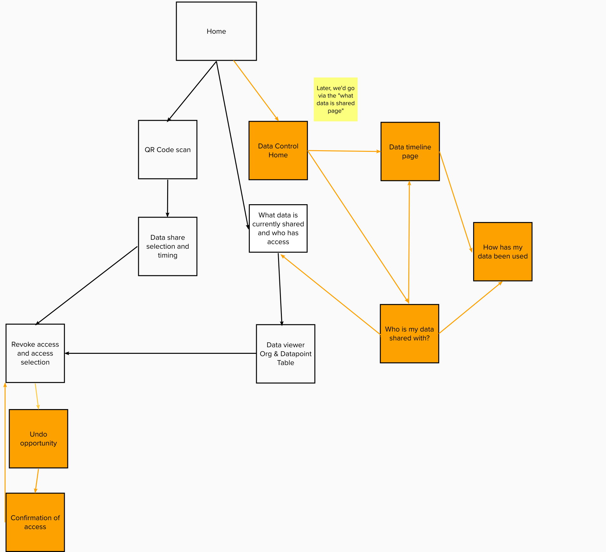
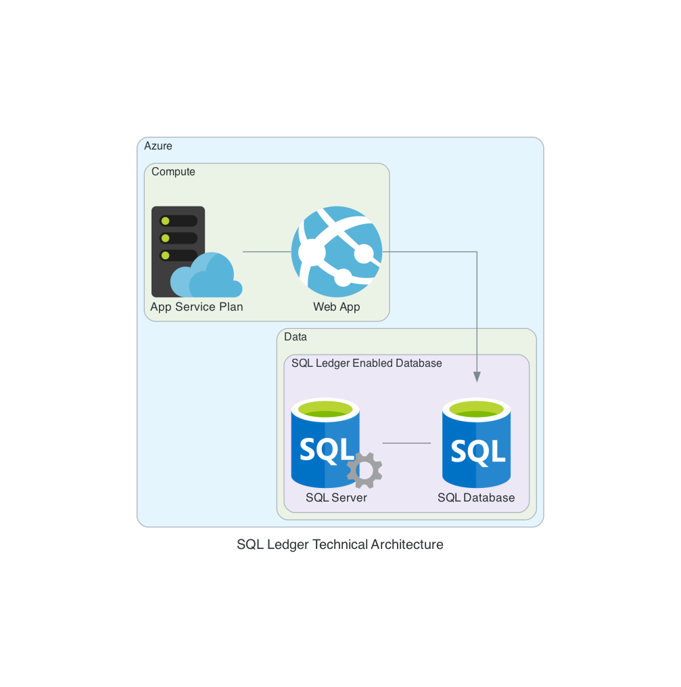

# SQL Ledger

Found in the `sql-ledger-demo` directory, a web application designed to show healthcare scenarios for SQL Ledger.

## Pre-requisites
- An Azure SQL service with ledger table capabilities turned on
- A hosting location
    1. Local with node.js or docker
    3. Azure hosting with node.js or docker container
# Setting up the application
## SQL setup

Once an Azure SQL with ledger tables enabled has been setup, use the [Setup.sql](https://github.com/Avanade/emtech-distributed-data/blob/main/sql/Setup.sql) to create the necesary tables within the database according to the data model below.

## .env file

Fill in the [.env file](https://github.com/Avanade/emtech-distributed-data/blob/main/sql-ledger-demo/.env.template) with the required details for your server.

You can either rename this `.env.local` for local running, or in the [App Settings](https://docs.microsoft.com/en-gb/azure/app-service/configure-common#configure-app-settings) for your application in Azure.

# Technical Architecture

### Data Model:

## User Journey

## Sitemap

## Technical Architecture

