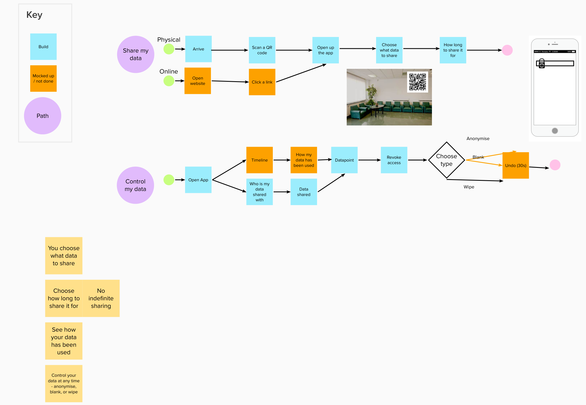

# SQL Ledger

Found in the `ledger-server` directory, a Python web application designed to show healthcare scenarios for SQL Ledger.

## Get started

`Pre-requestite`: An Azure SQL service with ledger capabilities turned on

### SQL setup

Once an Azure SQL with ledger enabled has been setup, use the [Setup.sql](ledger-server/Setup.sql) to create the necesary tables within the database accoriding to the data model:

### Data Model:

### .env file

Fill in the [.env file](ledger-server/.env.TEMPLATE) with the required details. Don't forget to whitelist the IP you will connect in from

## User Journey

## Sitemap

